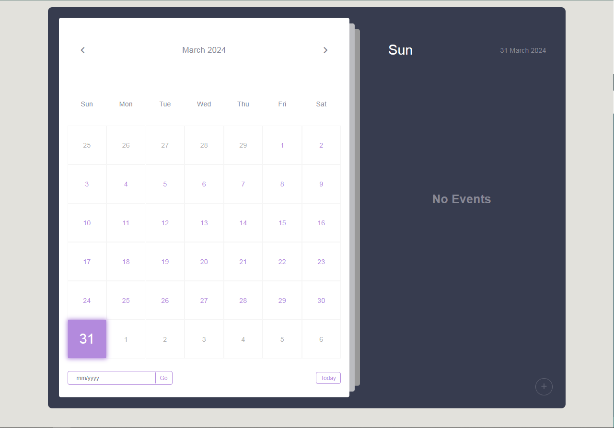

# Modern Calendar with Events

Stay organized with our user-friendly Calendar featuring events, reminders, and a customizable interface. Built with HTML, CSS, and JavaScript. Start scheduling today!



## Table of Contents
1. [Introduction](#introduction)
2. [Features](#features)
3. [Installation](#installation)
4. [Usage](#usage)
5. [Contributing](#contributing)
6. [License](#license)

## Introduction
This calendar application provides users with a simple and intuitive interface to manage events and reminders. It offers features such as month navigation, adding events, displaying events, and jumping to specific dates. Built using HTML, CSS, and JavaScript, it's easily customizable and can be integrated into various web projects.

## Features
- Navigate between months to view different time periods.
- Add events with customizable names and time intervals.
- Display events for the selected date.
- Jump to a specific date or go to the current date.
- Responsive design for seamless usage on different devices.

## Installation
1. Clone the repository:
    ```bash
    git clone https://github.com/gmpsankalpa/modern-calendar-with-events.git

2. Navigate to the project directory:
    ```bash
    cd calendar-with-events

3. Open `index.html` in your web browser to start using the application.

## Usage
1. Navigate through months using the left and right arrows.
2. Click on a specific date to view and manage events for that date.
3. To add a new event:
- Click on the "+" button.
- Fill in the event name and time details in the popup form.
- Click "Add Event" to save the event.
4. To jump to a specific date:
- Enter the desired date in the input field in the "Go to" section.
- Click "Go" to navigate to that date.
5. To go to the current date:
- Click on the "Today" button in the "Go to" section.

## Contributing
Contributions are welcome! Here's how you can contribute to this project:
1. Fork the repository.
2. Create a new branch (`git checkout -b feature/improvement`).
3. Make your changes.
4. Commit your changes (`git commit -am 'Add new feature'`).
5. Push to the branch (`git push origin feature/improvement`).
6. Create a new Pull Request.

## License
This project is licensed under the [MIT](LICENSE) License.

---

<p align="center">
<b>
  Repo Details 🤙
</b>
</p>

<div align="center">

   
   
   
   

</div>

<p align="center">
<b>
  Deploy status badge 🤖
</b>
</p>  

<div align="center">
   
   [](https://app.netlify.com/sites/gmp-calendar-with-events/deploys)
</div>